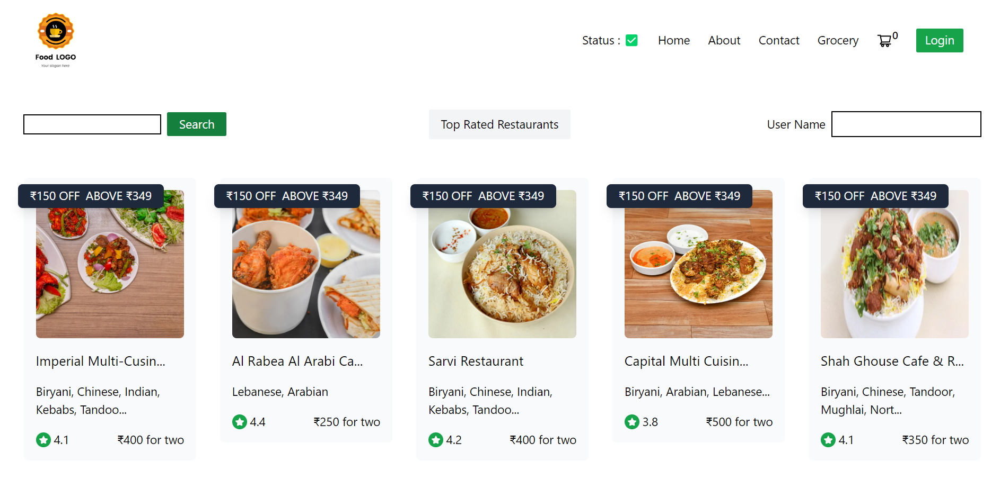

# FoodAdda

FoodAdda is a web application with features similar to Swiggy, offering a seamless way to discover delicious food from a variety of restaurants. With a dynamic and engaging user interface, it provides a delightful experience for food enthusiasts.

### Live Demo

Check out the live demo of FoodAdda at https://foodaddaa-103ee.web.app/.

### Key Features

- Seamless Integration with Swiggy's Public API: FoodAdda connects to Swiggy's public API to provide users with access to a wide range of restaurants and cuisines.
- Elegant Shimmer UI: The application features a stunning shimmer effect, enhancing the user experience and making the loading process engaging.
- Dynamic Landing Page: The homepage showcases various restaurants, cuisines, average ratings, and delivery times. It includes a captivating carousel to grab users' attention.
- Robust Search and Filtering: FoodAdda offers robust search and filtering options, making it easy for users to find their favorite dishes and restaurants.
- Detailed Restaurant Menu Pages: Explore detailed restaurant menu pages with categorized listings to make informed choices.
- Convenient Cart Management: A smooth shopping experience is ensured with convenient cart management, allowing users to add and remove items seamlessly.

### Tech Stack

FoodAdda is built using the following technologies:

- Parcel -- efficient package management
- Babel -- optimized rendering
- React JS and React Hooks (useState and useEffect)
- Custom Hooks -- enhanced functionality
- React Router DOM -- smooth navigation
- Redux store -- state management
- Tailwind CSS -- stylish and responsive design
- Jest and React Testing Library -- unit and integration testing

### Code Highlights

- Efficient Package Management: Utilizes Parcel for efficient package management, ensuring fast and reliable builds.
- Optimized Rendering: JSX is used for optimized rendering, enhancing the application's performance.
- Smooth Navigation: React Router ensures smooth navigation, creating an enjoyable user experience.
- State Management: The application leverages React useContext and Redux Toolkit for efficient state management.
- Controlled and Uncontrolled Components: Utilizes controlled and uncontrolled components for enhanced user interaction.
- Modern JavaScript Features: Incorporates modern JavaScript features such as optional chaining for improved code efficiency.
- Lazy Loading and Suspense: Implements lazy loading and suspense for improved performance.

### Installation

To run FoodAdda locally, follow these steps:

1. Clone the repository:

- git clone https://github.com/Chinmayee-mohapatra/FoodAddaa.git

2. Install the required dependencies:

- npm install

3. Start the development server:

- npm start

Open your browser and access http://localhost:3000 to view the application.
